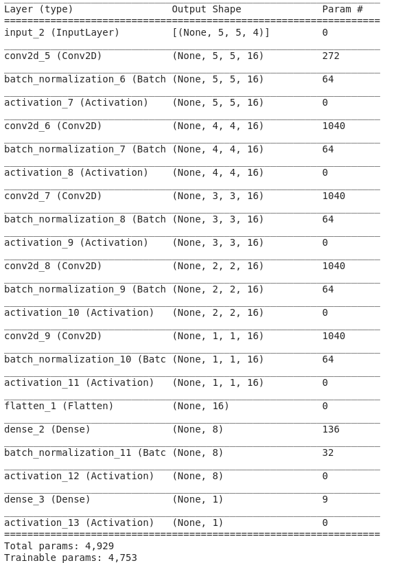

# **Grab Challenge - Traffic Management**

## **PROBLEM STATEMENT**

Economies in Southeast Asia are turning to AI to solve traffic congestion, which hinders mobility and economic growth. The first step in the push towards alleviating traffic congestion is to understand travel demand and travel patterns within the city.

Can we accurately forecast travel demand based on historical Grab bookings to predict areas and times with high travel demand?

In this challenge, I aim to build a model trained on a historical demand dataset, that can forecast demand on a Hold-out test dataset. The model should be able to accurately forecast ahead by T+1 to T+5 time intervals (where each interval is 15-min) given all data up to time T.

## **Generating predictions**

1) Open terminal and run pip3 install -r requirements.txt 

2) Run python3 generate_predictions.py -file < insert test set csv file path > 

The script will output a csv file of each geohash and its respective T+1 to T+5 predictions, the format is as shown:

| Geohash6 | day | timestamp | Hour | Minute | Predicted Demand |
| -------- | --- | --------- | ---- | ------ |----------------- |
|    ..    | ..  | .......   |  ... |  ...   |  ............    |

## **Training**

1) Open terminal and run pip3 install -r requirements.txt 

2) Put the dataset csv file into the Data/ folder.

3) Check the parameters in Config.py to match your preferences/settings.

4) Run preprocess_data.py in the Utils folder.

5) Run train.py

## **Methodology**

The intuition for this is that neighbouring location demands do play a part in affecting the demand for the target location. 

Hence, for every timestep t, the target geohash region i and its surrounding neighbours would be treated as a 5 X 5 grid with 4 channels, representing the demand for 1 period before, 1 day before, 1 week before and 2 weeks before for each location.

The 5 x 5 x 4 grid can be treated as an image and passed as an input for each timestep. The stacked CNN layers would also reduce the 'image' into a 1 X 1 X 16 grid before being passed through 2 fully-connected layer to generate the predicted demand for the time period.

The model architecture is shown here:

